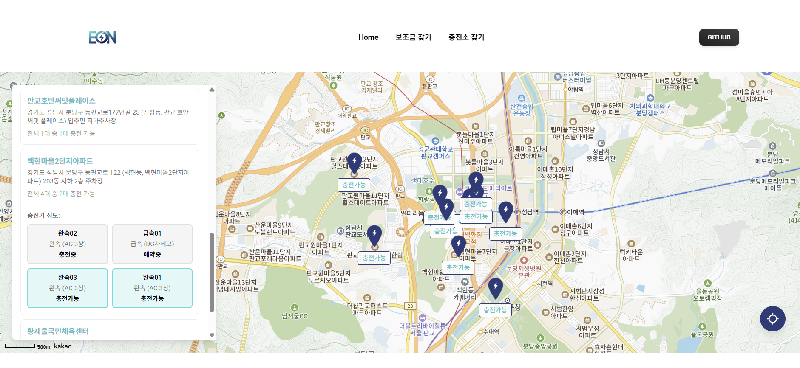
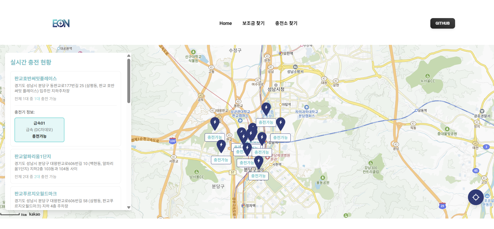

# [전기차 토탈 관리 플랫폼 - EON]

**소개**

EON은 전기차 사용자에게 구매·관리·운행 정보를 통합 제공하는 웹 프로젝트입니다.  
프론트엔드는 React + TypeScript + Vite로 구성되어 있습니다.

**주요기능**

- 차량별 보조금 검색 및 비교  
- 지역별 보조금(국비, 지방비) 정보 필터링  
- 유저 위치기반을 기준으로 가까운 전기차 충전소 검색  
- 전기차 충전소 운영정보, 충전타입 등의 정보 제공  
- 실시간 API 연동하여 최신 데이터 제공  
- VIte 기반 빠른 빌드

**상세기능**

- 지역별, 차종별 전기차 보조금 조회
- 차량 모델별 보조금 금액 비교

  

   
- 현재 위치 주변의 가까운 전기차 충전소 조회
- 실시간 충전 현황 정보 제공

  
  <p align="center">
  
</p>

<p align="center">
  
</p>

<br/>

**개발환경설정**

1. Node.js (권장 LTS) 설치
2. 의존성 설치
```js
npm install
```
3. 환경 변수 설정
```js
루트 디렉토리에 .env 파일 생성 후 값 입력

VITE_API_BASE_URL=api_base_url
VITE_API_KEY=api_key
VITE_KAKAO_MAP_KEY=kakao_map_api_key
```
4. 개발 서버 실행
```js
npm run dev
```

**기술스택**

[ Frontend Framework ] - React  
[ Language ] - Javascript  
[ Bundler ] - Vite  
[ Deploy ] - Vercel  

**폴더구조**

```
get-your-eon
    ├──📁public
    │   ├──📁css
    │   └──📁img
    ├──📁src
    │   ├──📁api
    │   ├──📁data
    │   ├──📁pages
    │   ├──📁widgets
    │   ├──📄App.jsx
    │   ├──📄main.jsx
    │   └──📄routes.jsx
    ├── .gitignore
    ├── CHANGELOG.md
    ├── index.html
    ├── ISSUE_TEMPLATE.md
    ├── jsconfig.json
    ├── LICENSE
    ├── package.json
    ├── postcsss.config.cjs
    ├── prettier.config.cjs
    ├── README.md
    ├── tailwind.config.cjs
    ├── vercel.json
    └── vite.config.js

```

**배포정보**

:rocket: https://get-your-eon.vercel.app
